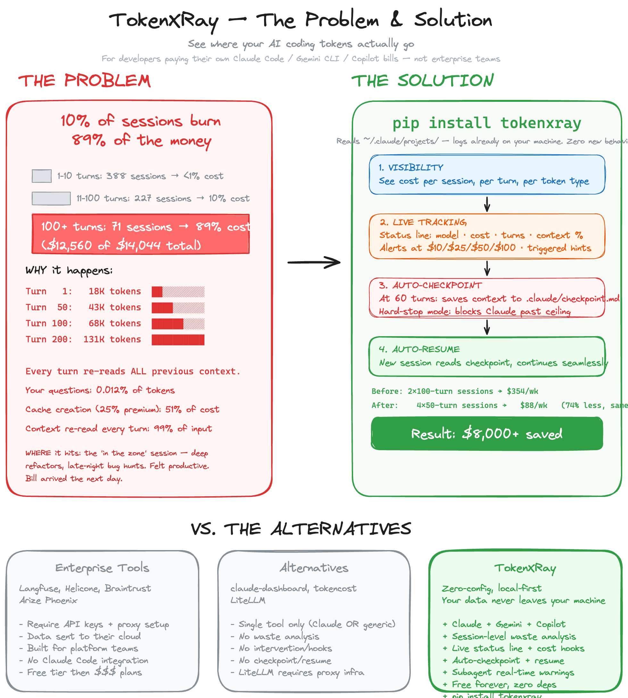

<p align="center">
  
</p>

# TokenXRay

**See where your AI coding tokens actually go.**

I spent $104 in a single Claude Code session. Then I audited all 514 of mine and found that **9% of sessions burned 92% of the money** — $11,600 out of $12,600 total. The culprit: context that grows quadratically, cache creation fees nobody mentions, and tool results that ride in context forever.

<p align="center">
  
</p>

## Install

```bash
pip install tokenxray
tokenxray --install-hook --confirm   # one-time setup, then forget about it
```

**Zero dependencies.** Pure Python stdlib. Python 3.9+.

## How It Works

TokenXRay has three layers: a **status line** always visible at the bottom of Claude Code, **hooks** that run automatically, and a **CLI** you run when you want to review your spending.

### Always-on: Status Line

After `--install-hook`, a persistent status line appears at the bottom of every Claude Code session showing live session health:

```
Opus │ $5.60 │ ▸▸ │ T42 │ ~$0.13/t │ ctx 38% │ ~43 left │ 27m
```

| Field | Meaning |
|-------|---------|
| `Opus` | Current model |
| `$5.60` | Total session cost (color-coded: green < $1, yellow < $5, red > $15) |
| `▸▸` | Spend velocity — more arrows = burning faster per turn |
| `T42` | Turn count |
| `~$0.13/t` | Average cost per turn |
| `ctx 38%` | Context window usage (color-coded: green < 50%, yellow < 75%, red > 90%) |
| `~43 left` | Estimated turns remaining before context fills |
| `27m` | Session duration |

**Actionable hints** — when a trigger fires, the status line switches from full metrics to a focused action line:

```
Opus │ $5.60 │ ctx 87% │ 🔥 ctx 87% — split now or lose context
```

Hints are prioritized — only the highest-priority action shows:

| Priority | Trigger | Hint |
|----------|---------|------|
| P1 | Rate limit < 3 requests left | `⚠ N req left — pause or hit rate limit` |
| P2 | Context > 85% | `🔥 ctx X% — split now or lose context` |
| P3 | Context > 60% | `⚠ ctx X% — split soon, saves ~60% tokens` |
| P4 | Opus + cost > $3 | `→ /model sonnet — same task, 5x cheaper` |
| P5 | 80+ turns + cost > $2 | `→ checkpoint & split — marathon burns 4x` |

Disable hints (keep metrics): set `"statusline_hints": false` in `~/.tokenxray/config.json`.

### Daily: Hooks (automatic, zero effort)

After `--install-hook`, every Claude Code session gets three hooks that run silently in the background:

1. **Cost hook** — tracks your running cost after every tool use. Shows a status line every 10 turns. Alerts when you cross $1/$3/$5/$10/$25/$50. At 60 turns or $5, auto-saves your session state to `.claude/checkpoint.md`. If you're on Opus, nudges you once to consider switching to Sonnet (5x cheaper for most tasks).
2. **Resume hook** — when you start a new session, detects the checkpoint and prints last session stats + the checkpoint path. **Claude does not read the checkpoint automatically** — tell it to: *"read .claude/checkpoint.md.loaded"*. One-shot: fires once per session, then gets out of the way.
3. **Subagent hook** — fires before each `Agent` tool call. Full warning on first call per session, brief reminder every 5 calls. Agents spawn new context windows at full cost — this nudges you to consider whether delegation is worth it.

Your daily workflow:
```
Open Claude Code → status line shows live metrics at bottom
       ↓
Checkpoint detected? Stats shown in conversation
       ↓
Tell Claude: "read .claude/checkpoint.md.loaded" → context restored
       ↓
Work normally → cost hook + status line track silently
       ↓
Hit 60 turns or $5 → checkpoint auto-saved
       ↓
Status line hint fires? Take the action or keep going
       ↓
Start fresh → next session picks up where you left off
```

You never run `tokenxray` during a session. The hooks and status line handle it.

```
[TokenXRay] Opus — turn 40, $12.50 total, ~$0.31/turn, ctx 85K
[TokenXRay] You're on Opus ($15/MTok input) — Sonnet costs 5x less and handles most coding tasks well.
[TokenXRay] Consider switching: /model claude-sonnet-4-6
[TokenXRay] Consider splitting this session! (60 turns, $5.20, ctx 90K)
[TokenXRay] Auto-checkpoint saved to .claude/checkpoint.md
```

**Hard-stop mode** (opt-in): block further tool use past a ceiling so Claude is forced to wrap up. Enable in `~/.tokenxray/config.json`:

```json
{"hard_stop": true, "hard_stop_turns": 120, "hard_stop_cost": 50}
```

When either ceiling is crossed, the hook exits with code 2. Every subsequent tool call fails with the hard-stop message until you start a fresh session. Off by default — the advisory split warning still fires regardless.

### Weekly: CLI (manual review)

Run these when you want to understand your spending patterns and change habits:

```bash
tokenxray                  # Overview — where your money goes
tokenxray --diagnose       # Specific recommendations
tokenxray --session <id>   # Deep dive into one session
tokenxray --dashboard      # Interactive HTML charts
tokenxray --projects       # Cost by project
tokenxray --mcp            # MCP tool audit — find dead-weight servers
```

```
TokenXRay - Session Overview
----------------------------------------------------------------------
  514 sessions    43,000+ total turns    $12,600+ total cost

  Segment Breakdown:
    1-10 turns:  329 sessions  avg  $0.19   total    $62   ░░░░░░░░░░  0%
         11-30:   76 sessions  avg  $4.01   total   $305   ░░░░░░░░░░  2%
        31-100:   61 sessions  avg $11.05   total   $674   █░░░░░░░░░  5%
          100+:   48 sessions  avg   $241   total $11,600  ████████░░ 92%
```

The retrospective analysis is the most valuable part. After a few `--diagnose` runs, you start naturally scoping sessions better — "I'll do the refactor, then start fresh for tests." That's where the real savings come from.

## Configuration

Customize hook thresholds in `~/.tokenxray/config.json`:

```json
{
    "split_turns": 60,
    "split_cost": 5,
    "alert_thresholds": [1, 3, 5, 10, 25, 50],
    "status_interval": 10,
    "debug_log": false,
    "hard_stop": false,
    "hard_stop_turns": 120,
    "hard_stop_cost": 50,
    "opus_nudge": true,
    "opus_nudge_turn": 20,
    "opus_nudge_cost": 5.0,
    "subagent_warn": true,
    "subagent_warn_interval": 5,
    "statusline_hints": true
}
```

## Debugging Hooks

By default, hooks only print user-facing messages in conversation. If you need deeper diagnostics, enable internal hook logging:

```json
{"debug_log": true}
```

This writes hook events to `~/.tokenxray/debug.log` (cost/resume/subagent hooks). Useful when a warning seems missing and you want to verify whether the hook fired, skipped, or hit an exception-safe path.

```bash
tail -f ~/.tokenxray/debug.log
```

Set `"debug_log": false` when done.

## Supported Tools

| Tool | Source | Notes |
|------|--------|-------|
| **Claude Code** | `~/.claude/projects/**/*.jsonl` | Full token breakdown: input, output, cache read, cache create |
| **Gemini CLI** | `~/.gemini/tmp/*/chats/session-*.json` | Input, output, cached, thinking tokens |
| **GitHub Copilot** | VS Code workspace storage | Estimated from message lengths (token events are ephemeral) |

```bash
tokenxray --source claude    # Claude only
tokenxray --source gemini    # Gemini only
tokenxray --source copilot   # Copilot only
tokenxray --source all       # Everything (default)
```

**Your data stays local.** TokenXRay reads files on your machine. Nothing is sent anywhere.

## Additional Flags

| Flag | Description |
|------|-------------|
| `--top N` | Show top N sessions (default: 15) |
| `--path <dir>` | Custom path to session logs directory |
| `--no-color` | Disable colored output |
| `--baseline` / `--compare` | Save baseline, compare after changing habits |
| `--export csv` | Export sessions to CSV |
| `--checkpoint` | Manually extract session state |
| `--mcp` | MCP tool audit — dead-weight servers, unused tools, schema cost estimate |
| `--mcp --enumerate-tools` | Spawn each configured MCP server and get exact tool counts |

## MCP Tool Audit

Every MCP server you configure globally loads its full tool schema into Claude's context on every session start — roughly **185 tokens per tool**. At 84 tools across a few servers, that's ~15K tokens per session, silently added even when you never call a single MCP tool.

```bash
tokenxray --mcp                   # Audit from call history
tokenxray --mcp --enumerate-tools # Also spawn servers to get exact tool counts
```

Output shows per-server call rates, never-called tools, and a dead-weight estimate: sessions that loaded schemas but called zero MCP tools. The fix is usually moving from global `~/.claude.json` config to project-level `.mcp.json` so servers only load where you actually use them.

## The Full Story

Read the detailed analysis: [I Spent $104 in a Single AI Coding Session. Then I Audited All 514 of Mine.](blog/i-spent-104-dollars-in-one-ai-session.md)

## License

MIT
